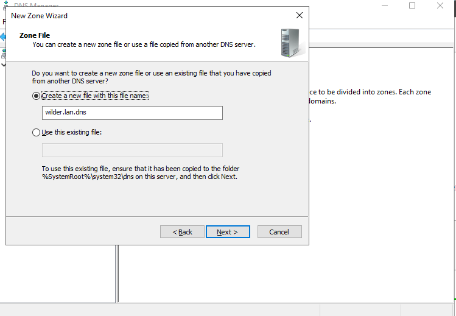
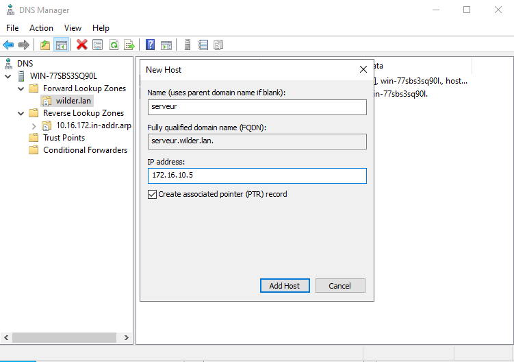
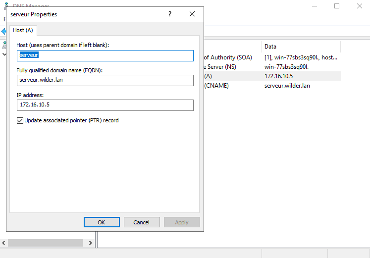
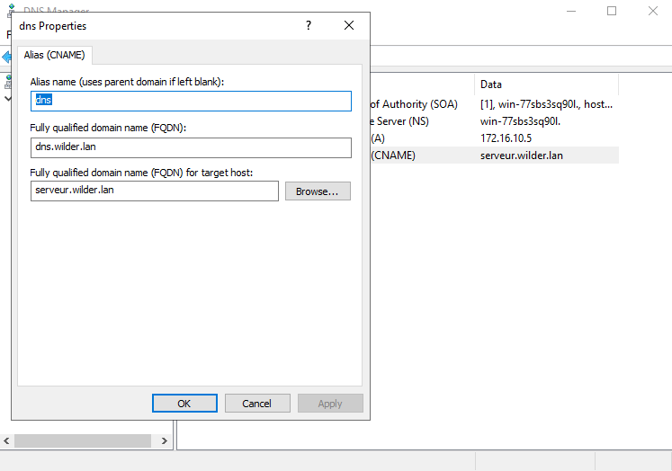
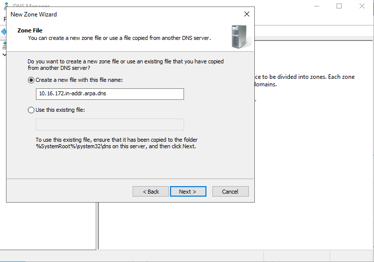
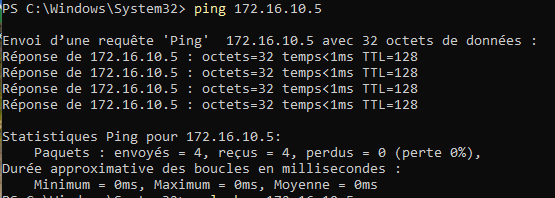
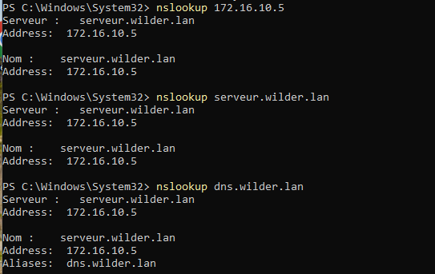

# Serveur_DNS_avec_Windowd_Server

## Configuration du serveur DNS :

### Zone direct :

|      |  |
| --------------------------- | --------------------------- |
|  |  |

* Non de la zone wilders.lan
* Configuration du host (A) "serveur" en liens avec l'adresse IP
* Configuration de l'allas (CNAME) avec le nom dns.wilder.lan

Forward Lookup Zone :
  * Serveur.wilder.lan = 172.16.10.5
  * dns.wilder.lan = serveur.wilder.lan

### Zone indirect :

* Configuartion de la plage réseau

Reverse Lookup Zone :
  * 172.16.10.5 = serveur.wilder.lan

## Client windows 11 :

### Ping :

* Résultat du ping

### Commande nslookup :

* Résultat des commandes nslookup
